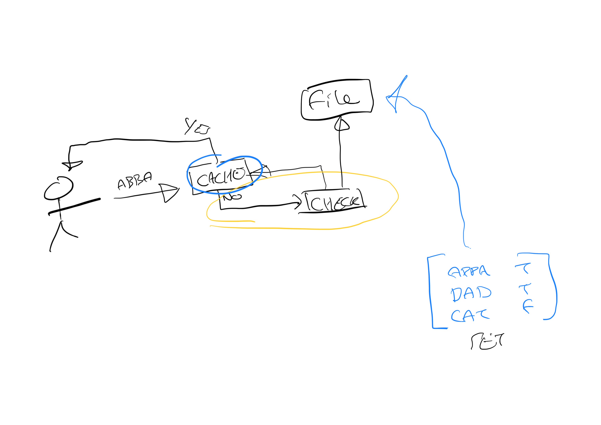

# Palindrome Checker Project

## Overview

The Palindrome Checker Project is a web application designed to check if a given text is a palindrome. It utilizes Spring Boot for its backend services and Reactor for reactive programming. The project is structured to use an in-memory caching system, which can be easily replaced with other caching implementations.

### Build Tools and Architecture

- **Build Tools**: The project uses Maven for dependency management and build automation. Maven helps manage project dependencies, build processes, and configuration.
  
- **Architecture**:
  - **Spring Boot**: Provides the foundation for the application with embedded servers and configuration management.
  - **Reactor**: Utilized for reactive programming, enabling non-blocking operations and asynchronous data processing.
  - **In-Memory Cache**: An in-memory ICache implementation using `ConcurrentHashMap`, allowing thread-safe operations. This ICache can be replaced with other implementations like Redis if needed.
  - **Validation System**: A flexible and extendable validation system that allows defining and chaining multiple validation rules to ensure input text meets specific criteria.

### REST API Rationale

The REST API is designed to provide a simple and efficient interface for checking if a text is a palindrome. The API uses a POST method to handle requests, allowing clients to send both the username and the text for checking. This approach:
- **Encapsulates Business Logic**: The palindrome checking logic is encapsulated in a service layer, making it reusable and testable.
- **Supports Asynchronous Processing**: By using `Mono` from Reactor, the API can handle asynchronous and non-blocking operations efficiently.
- **Provides Caching**: Caching mechanisms improve performance by storing previously checked texts, reducing redundant computations.

## Getting Started

### Prerequisites

- Java 17 or later
- Maven

### Installation

1. **Clone the repository**:

   ```bash
   git clone https://github.com/shaneharrigan/pali-project.git
   cd pali-project
   ```
2. **Build the project:**
   ```bash
   mvn clean install
   ```
3. **Run the tests:**
   ```bash
   mvn test
   ```
3. **Run the application:**
   ```bash
   mvn spring-boot:run
   ```
## API Endpoints

- Check Palindrome
- URL: /api/1/palindrome
- Method: POST
- Parameters:
- username (String) - The username associated with the request.
- text (String) - The text to check.
- Response: Boolean - Returns true if the text is a palindrome, false otherwise.

  ```bash
  curl -X POST "http://localhost:8080/api/1/palindrome" -d "username=user&text=madam"
  ```
## Validation System
The project includes a flexible validation system designed to ensure that input text meets specific criteria before palindrome checking. The validation system is structured as follows:

- **ValidationChain**: A class that allows chaining multiple validation rules.
- **IValidationRule**: An interface for defining validation rules.
- **Validation Rules**: Implementations of IValidationRule for specific validation criteria.

### Validation Modes
- **ALL**: Requires all rules to pass for the text to be considered valid.
- **ANY**: Requires at least one rule to pass for the text to be considered valid.

## Caching

The project includes an InMemoryCache implementation. The ICache is used to store and retrieve previously checked texts to improve performance. The caching mechanism can be replaced with other implementations by modifying the Cache interface and its implementations.

## Assumptions
- **Spring boot**: we utilised spring boot over other frameworks because of some opinions which would speed up the development process greatly.
- **Caching**: the cache does not have a degradation process, no entries are removed though we provided the functionality to do so later if necessary.
   - **"Each processed value should also be written to a permanent storage solution"** - we limit the term processed value to mean a request which required further analysis (the text input was never seen before), if we only need to hit the cache then we don't need to record the result. This approach means we can treat the initial load of values as a set operation which means we can better implemented caching later on in-house.
- **Validation system**: we decided to go for chain paradigm to provided broadest flexibility and erogonomics; originally we could have gone with a static fields approach but that would be cumbersome and unlikely to scale well. The example chains are not the best coverage as it would be better to offer more fine-grain rules (uppercase, lowercase etc.) but we provide a mode system to allow for flexibility at the behaviour level.
- **Text input**: we assumed that all inputs should be lowercased and trimmed.
- **Endpoints**: because this results in a potential side effect (writing to storage) we designnated the POST verbage, a GET would also have worked but we felt that POST better communicated that "this can lead to a stateful change before the web server". We also assumed that the endpoint inputs would be query parameters - this is just for taste and prototyping.
   - originally we thought about using a DTO to format the response of the endpoint but we decided for simplicity that the response payload should just be the palindrome result. It just makes for easier test automation and saves a few lines of code but in principle an "indicator" should not need to be extracted. Additionally, we use a version managed endpoint system to allow for controlled changes.
- **Web server**: we used netty because it is pretty standardised and good performance.
- **Diagnostics**: we use both console logging (controlled via properties) and prometheus tooling for coverage.

## Performance Note
- **Palindrome Order**: O(N) time / O(1) space
- **Vanilla Configuration Startup Time**: 0.812 seconds
- **Optimized Configuration Startup Time**: 0.592 seconds

The optimizations applied to the configuration resulted in a modest reduction in startup time, demonstrating the efficiency improvements achieved through tailored configuration adjustments.
